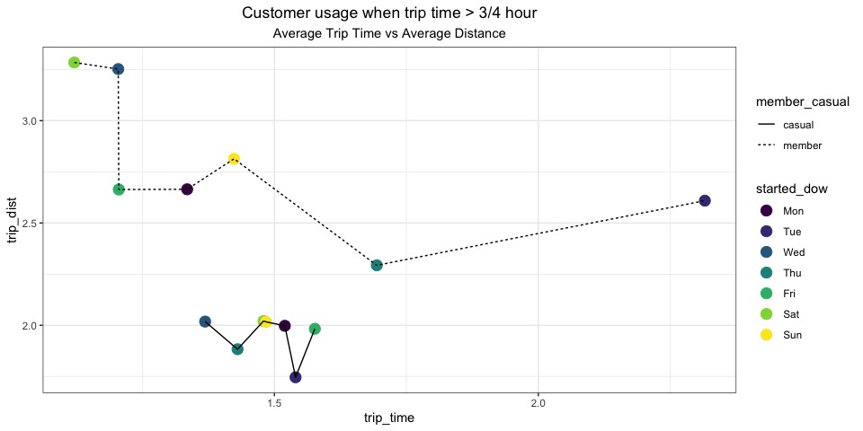

Capstone-bike-case-study-github
================
Patrick Brooks - Partial fulfillment of Google Analysis Certificate

- [Executive Summary](#executive-summary)
  - [1. Introduction](#1-introduction)
  - [2. Assumptions and Definitions](#2-assumptions-and-definitions)
  - [3. Methodology](#3-methodology)
  - [4. A summary of your analysis, visualizations and key
    findings](#4-a-summary-of-your-analysis-visualizations-and-key-findings)
  - [5 References](#5-references)
    - [Data Dictionary](#data-dictionary)
    - [Articles](#articles)
    - [R Environment](#r-environment)
    - [Data sources](#data-sources)

# Executive Summary

The purpose of this analysis is to explore how annual members and casual
riders use Cyclistic bikes differently. An analysis of 4 months in 2022
(June - September). The observed differences are:  
- Casual customers use the bikes more on weekends and members use the
bikes more during the weekdays.  
- Casual customers tend to use the electric bike and members use the
classic bike.  
- Casual customers will tend to use the bike longer and not travel as
far. Members will tend to ride the the bike further  

The paper below outlines the business context, problem statement,
assumptions, methodology, analysis and discussion.

## 1. Introduction

Cyclistic is a bike-sharing company that features 5,824 geo-tracked
bikes and 692 docking stations across Chicago. Bikes are unlocked at one
station and returned to any other station at anytime. Cyclistic
differentiates itself by offering reclining bikes, and other bikes that
make sharing more inclusive. The majority of riders opt for traditional
bikes; about 8% use the assistive options. Most Cyclistic users ride for
leisure with 30% using the bikes to commute to work.

The Directory of Marketing, Lily Moreno, thinks that future company
success will come from maximizing annual membership. The data analysis
team needs to better understand:

1.  How do annual members and casual riders use Cyclistic bikes
    differently?  
2.  Why would casual riders buy Cyclistic annual memberships?  
3.  How can Cyclistic use digital media to influence casual riders to
    become members?  

This analysis will focus on the first question  

> How casual riders and annual members use Cyclistic bikes differently  

## 2. Assumptions and Definitions

See the reference section below for R packages used, data source,
license agreement and privacy and data dictionary.

- Casual riders - purchase single-ride or full-day passes  
- Members - Use bikes for any length of time  
- Specific data used in this analysis were months of June-September
  of 2022. This period would reflect spring/summer periods and
  post-COVID lock-down.  
- Along with the data provided several additional fields were
  calculated. 

## 3. Methodology

Data was downloaded to a local computer. The data is not stored on
GitHub. Pointers to the specific data sets are provided in the reference
section.

The monthly datasets are very large and combining the four months
resulted in 3 million plus records. All of the data was ‘cleaned’. The
number of casual customers are likely different from the number of
members. To minimize a sampling bians data was sampled by randomly
selecting 1% of the casual customers and 1% of the members. Roughly 60k
samples were used to complete the analysis. A ransom seed was set to
provide analysis reproducability.

Data cleaning included:

- Keep rows with positive trip time (end was later than start)  
- Keep rows not NA and triptime \> 1 minute (assume less than one minute
  was user or machine error)  
- Keep rows where end station name and longitude exist (remove data that
  did not have an endpoint)  
- Created variable tip_time from the difference between the ended_at and
  started_at variable. 
- Create variables started_dow and ended_dow as day of week with Monday
  as the starting day.  
- Created variable trip_dist by calculating distance based on longitude
  and latitude. 
- Created category variable trip_type for trips less than or equal 45
  minutes or trips longer than 45 minutes - casual user bike rides
  include the first 45 minutes 

For readability output from the R code was turned off. Source codes is
available from the git-hub site [‘here’](bike-case-study.Rmd)

Results from sampling the whole data set are provided here. There are
3009476 total rows of data. For this analysis we randomly selected 30095
of casual and member customers. The randsom generator seed was set to
53679

## 4. A summary of your analysis, visualizations and key findings

#### Observation \#1

Casual customer use the bikes more toward the weekend and members use
the bikes most, during the week.

<!-- -->

#### Observation \#2

Casual and members tend to use the electric bike and members use the
classic bike.

<!-- -->

#### Observation \#3

The current member bike service is base upon 3/4 hour. Over 3/4 hour,
members are charged for additional minutes. The casual user is for their
entire time of use. Casual users will tend to use the bike longer and
not travel as far. Members will tend to take the bike further

<!-- --><!-- -->
<table>
<caption>
Ride length (hours) and Customer
</caption>
<thead>
<tr>
<th style="text-align:left;">
</th>
<th style="text-align:right;">
\<=3/4
</th>
<th style="text-align:right;">
\>3/4
</th>
</tr>
</thead>
<tbody>
<tr>
<td style="text-align:left;">
casual
</td>
<td style="text-align:right;">
27057
</td>
<td style="text-align:right;">
3038
</td>
</tr>
<tr>
<td style="text-align:left;">
member
</td>
<td style="text-align:right;">
29550
</td>
<td style="text-align:right;">
545
</td>
</tr>
</tbody>
</table>

## 5 References

### Data Dictionary

Additional information about the data can be found at [DIVVY FAQ
site](https://divvybikes.com/for-everyone).  

[Data Licensing
Agreement](https://www.divvybikes.com/data-license-agreement).  

Variables include in the data sets:

<table>
<caption>
Data Dictionary
</caption>
<thead>
<tr>
<th style="text-align:left;">
item
</th>
<th style="text-align:left;">
class
</th>
<th style="text-align:left;">
summary
</th>
<th style="text-align:left;">
value
</th>
</tr>
</thead>
<tbody>
<tr>
<td style="text-align:left;">
</td>
<td style="text-align:left;">
</td>
<td style="text-align:left;">
Rows in dataset
</td>
<td style="text-align:left;">
3009476
</td>
</tr>
<tr>
<td style="text-align:left;">
</td>
<td style="text-align:left;">
</td>
<td style="text-align:left;">
Columns in dataset
</td>
<td style="text-align:left;">
18
</td>
</tr>
<tr>
<td style="text-align:left;">
ride_id
</td>
<td style="text-align:left;">
character
</td>
<td style="text-align:left;">
unique responses
</td>
<td style="text-align:left;">
3009476
</td>
</tr>
<tr>
<td style="text-align:left;">
</td>
<td style="text-align:left;">
</td>
<td style="text-align:left;">
missing
</td>
<td style="text-align:left;">
0
</td>
</tr>
<tr>
<td style="text-align:left;">
rideable_type
</td>
<td style="text-align:left;">
factor
</td>
<td style="text-align:left;">
classic_bike (1)
</td>
<td style="text-align:left;">
1406436
</td>
</tr>
<tr>
<td style="text-align:left;">
</td>
<td style="text-align:left;">
</td>
<td style="text-align:left;">
docked_bike (2)
</td>
<td style="text-align:left;">
105181
</td>
</tr>
<tr>
<td style="text-align:left;">
</td>
<td style="text-align:left;">
</td>
<td style="text-align:left;">
electric_bike (3)
</td>
<td style="text-align:left;">
1497859
</td>
</tr>
<tr>
<td style="text-align:left;">
</td>
<td style="text-align:left;">
</td>
<td style="text-align:left;">
missing
</td>
<td style="text-align:left;">
0
</td>
</tr>
<tr>
<td style="text-align:left;">
started_at
</td>
<td style="text-align:left;">
POSIXct POSIXt
</td>
<td style="text-align:left;">
mean
</td>
<td style="text-align:left;">
2022-07-30
</td>
</tr>
<tr>
<td style="text-align:left;">
</td>
<td style="text-align:left;">
</td>
<td style="text-align:left;">
mode
</td>
<td style="text-align:left;">
2022-07-09
</td>
</tr>
<tr>
<td style="text-align:left;">
</td>
<td style="text-align:left;">
</td>
<td style="text-align:left;">
min
</td>
<td style="text-align:left;">
2022-06-01
</td>
</tr>
<tr>
<td style="text-align:left;">
</td>
<td style="text-align:left;">
</td>
<td style="text-align:left;">
max
</td>
<td style="text-align:left;">
2022-09-30
</td>
</tr>
<tr>
<td style="text-align:left;">
</td>
<td style="text-align:left;">
</td>
<td style="text-align:left;">
missing
</td>
<td style="text-align:left;">
0
</td>
</tr>
<tr>
<td style="text-align:left;">
ended_at
</td>
<td style="text-align:left;">
POSIXct POSIXt
</td>
<td style="text-align:left;">
mean
</td>
<td style="text-align:left;">
2022-07-30
</td>
</tr>
<tr>
<td style="text-align:left;">
</td>
<td style="text-align:left;">
</td>
<td style="text-align:left;">
mode
</td>
<td style="text-align:left;">
2022-07-09
</td>
</tr>
<tr>
<td style="text-align:left;">
</td>
<td style="text-align:left;">
</td>
<td style="text-align:left;">
min
</td>
<td style="text-align:left;">
2022-06-01
</td>
</tr>
<tr>
<td style="text-align:left;">
</td>
<td style="text-align:left;">
</td>
<td style="text-align:left;">
max
</td>
<td style="text-align:left;">
2022-10-01
</td>
</tr>
<tr>
<td style="text-align:left;">
</td>
<td style="text-align:left;">
</td>
<td style="text-align:left;">
missing
</td>
<td style="text-align:left;">
0
</td>
</tr>
<tr>
<td style="text-align:left;">
start_station_name
</td>
<td style="text-align:left;">
character
</td>
<td style="text-align:left;">
unique responses
</td>
<td style="text-align:left;">
1567
</td>
</tr>
<tr>
<td style="text-align:left;">
</td>
<td style="text-align:left;">
</td>
<td style="text-align:left;">
missing
</td>
<td style="text-align:left;">
405445
</td>
</tr>
<tr>
<td style="text-align:left;">
start_station_id
</td>
<td style="text-align:left;">
character
</td>
<td style="text-align:left;">
unique responses
</td>
<td style="text-align:left;">
1289
</td>
</tr>
<tr>
<td style="text-align:left;">
</td>
<td style="text-align:left;">
</td>
<td style="text-align:left;">
missing
</td>
<td style="text-align:left;">
405445
</td>
</tr>
<tr>
<td style="text-align:left;">
end_station_name
</td>
<td style="text-align:left;">
character
</td>
<td style="text-align:left;">
unique responses
</td>
<td style="text-align:left;">
1574
</td>
</tr>
<tr>
<td style="text-align:left;">
</td>
<td style="text-align:left;">
</td>
<td style="text-align:left;">
missing
</td>
<td style="text-align:left;">
427084
</td>
</tr>
<tr>
<td style="text-align:left;">
end_station_id
</td>
<td style="text-align:left;">
character
</td>
<td style="text-align:left;">
unique responses
</td>
<td style="text-align:left;">
1292
</td>
</tr>
<tr>
<td style="text-align:left;">
</td>
<td style="text-align:left;">
</td>
<td style="text-align:left;">
missing
</td>
<td style="text-align:left;">
427084
</td>
</tr>
<tr>
<td style="text-align:left;">
start_lat
</td>
<td style="text-align:left;">
numeric
</td>
<td style="text-align:left;">
mean
</td>
<td style="text-align:left;">
42
</td>
</tr>
<tr>
<td style="text-align:left;">
</td>
<td style="text-align:left;">
</td>
<td style="text-align:left;">
median
</td>
<td style="text-align:left;">
42
</td>
</tr>
<tr>
<td style="text-align:left;">
</td>
<td style="text-align:left;">
</td>
<td style="text-align:left;">
min
</td>
<td style="text-align:left;">
41.64
</td>
</tr>
<tr>
<td style="text-align:left;">
</td>
<td style="text-align:left;">
</td>
<td style="text-align:left;">
max
</td>
<td style="text-align:left;">
42.07
</td>
</tr>
<tr>
<td style="text-align:left;">
</td>
<td style="text-align:left;">
</td>
<td style="text-align:left;">
missing
</td>
<td style="text-align:left;">
0
</td>
</tr>
<tr>
<td style="text-align:left;">
start_lng
</td>
<td style="text-align:left;">
numeric
</td>
<td style="text-align:left;">
mean
</td>
<td style="text-align:left;">
-88
</td>
</tr>
<tr>
<td style="text-align:left;">
</td>
<td style="text-align:left;">
</td>
<td style="text-align:left;">
median
</td>
<td style="text-align:left;">
-88
</td>
</tr>
<tr>
<td style="text-align:left;">
</td>
<td style="text-align:left;">
</td>
<td style="text-align:left;">
min
</td>
<td style="text-align:left;">
-87.84
</td>
</tr>
<tr>
<td style="text-align:left;">
</td>
<td style="text-align:left;">
</td>
<td style="text-align:left;">
max
</td>
<td style="text-align:left;">
-87.52
</td>
</tr>
<tr>
<td style="text-align:left;">
</td>
<td style="text-align:left;">
</td>
<td style="text-align:left;">
missing
</td>
<td style="text-align:left;">
0
</td>
</tr>
<tr>
<td style="text-align:left;">
end_lat
</td>
<td style="text-align:left;">
numeric
</td>
<td style="text-align:left;">
mean
</td>
<td style="text-align:left;">
42
</td>
</tr>
<tr>
<td style="text-align:left;">
</td>
<td style="text-align:left;">
</td>
<td style="text-align:left;">
median
</td>
<td style="text-align:left;">
42
</td>
</tr>
<tr>
<td style="text-align:left;">
</td>
<td style="text-align:left;">
</td>
<td style="text-align:left;">
min
</td>
<td style="text-align:left;">
41.55
</td>
</tr>
<tr>
<td style="text-align:left;">
</td>
<td style="text-align:left;">
</td>
<td style="text-align:left;">
max
</td>
<td style="text-align:left;">
42.37
</td>
</tr>
<tr>
<td style="text-align:left;">
</td>
<td style="text-align:left;">
</td>
<td style="text-align:left;">
missing
</td>
<td style="text-align:left;">
0
</td>
</tr>
<tr>
<td style="text-align:left;">
end_lng
</td>
<td style="text-align:left;">
numeric
</td>
<td style="text-align:left;">
mean
</td>
<td style="text-align:left;">
-88
</td>
</tr>
<tr>
<td style="text-align:left;">
</td>
<td style="text-align:left;">
</td>
<td style="text-align:left;">
median
</td>
<td style="text-align:left;">
-88
</td>
</tr>
<tr>
<td style="text-align:left;">
</td>
<td style="text-align:left;">
</td>
<td style="text-align:left;">
min
</td>
<td style="text-align:left;">
-88.05
</td>
</tr>
<tr>
<td style="text-align:left;">
</td>
<td style="text-align:left;">
</td>
<td style="text-align:left;">
max
</td>
<td style="text-align:left;">
-87.3
</td>
</tr>
<tr>
<td style="text-align:left;">
</td>
<td style="text-align:left;">
</td>
<td style="text-align:left;">
missing
</td>
<td style="text-align:left;">
0
</td>
</tr>
<tr>
<td style="text-align:left;">
member_casual
</td>
<td style="text-align:left;">
factor
</td>
<td style="text-align:left;">
casual (1)
</td>
<td style="text-align:left;">
1397625
</td>
</tr>
<tr>
<td style="text-align:left;">
</td>
<td style="text-align:left;">
</td>
<td style="text-align:left;">
member (2)
</td>
<td style="text-align:left;">
1611851
</td>
</tr>
<tr>
<td style="text-align:left;">
</td>
<td style="text-align:left;">
</td>
<td style="text-align:left;">
missing
</td>
<td style="text-align:left;">
0
</td>
</tr>
<tr>
<td style="text-align:left;">
trip_time
</td>
<td style="text-align:left;">
numeric
</td>
<td style="text-align:left;">
mean
</td>
<td style="text-align:left;">
0
</td>
</tr>
<tr>
<td style="text-align:left;">
</td>
<td style="text-align:left;">
</td>
<td style="text-align:left;">
median
</td>
<td style="text-align:left;">
0
</td>
</tr>
<tr>
<td style="text-align:left;">
</td>
<td style="text-align:left;">
</td>
<td style="text-align:left;">
min
</td>
<td style="text-align:left;">
0.02
</td>
</tr>
<tr>
<td style="text-align:left;">
</td>
<td style="text-align:left;">
</td>
<td style="text-align:left;">
max
</td>
<td style="text-align:left;">
533.92
</td>
</tr>
<tr>
<td style="text-align:left;">
</td>
<td style="text-align:left;">
</td>
<td style="text-align:left;">
missing
</td>
<td style="text-align:left;">
0
</td>
</tr>
<tr>
<td style="text-align:left;">
started_dow
</td>
<td style="text-align:left;">
ordered factor
</td>
<td style="text-align:left;">
Mon (1)
</td>
<td style="text-align:left;">
353088
</td>
</tr>
<tr>
<td style="text-align:left;">
</td>
<td style="text-align:left;">
</td>
<td style="text-align:left;">
Tue (2)
</td>
<td style="text-align:left;">
398414
</td>
</tr>
<tr>
<td style="text-align:left;">
</td>
<td style="text-align:left;">
</td>
<td style="text-align:left;">
Wed (3)
</td>
<td style="text-align:left;">
432832
</td>
</tr>
<tr>
<td style="text-align:left;">
</td>
<td style="text-align:left;">
</td>
<td style="text-align:left;">
Thu (4)
</td>
<td style="text-align:left;">
452221
</td>
</tr>
<tr>
<td style="text-align:left;">
</td>
<td style="text-align:left;">
</td>
<td style="text-align:left;">
Fri (5)
</td>
<td style="text-align:left;">
464777
</td>
</tr>
<tr>
<td style="text-align:left;">
</td>
<td style="text-align:left;">
</td>
<td style="text-align:left;">
Sat (6)
</td>
<td style="text-align:left;">
502902
</td>
</tr>
<tr>
<td style="text-align:left;">
</td>
<td style="text-align:left;">
</td>
<td style="text-align:left;">
Sun (7)
</td>
<td style="text-align:left;">
405242
</td>
</tr>
<tr>
<td style="text-align:left;">
</td>
<td style="text-align:left;">
</td>
<td style="text-align:left;">
missing
</td>
<td style="text-align:left;">
0
</td>
</tr>
<tr>
<td style="text-align:left;">
ended_dow
</td>
<td style="text-align:left;">
ordered factor
</td>
<td style="text-align:left;">
Mon (1)
</td>
<td style="text-align:left;">
353621
</td>
</tr>
<tr>
<td style="text-align:left;">
</td>
<td style="text-align:left;">
</td>
<td style="text-align:left;">
Tue (2)
</td>
<td style="text-align:left;">
398316
</td>
</tr>
<tr>
<td style="text-align:left;">
</td>
<td style="text-align:left;">
</td>
<td style="text-align:left;">
Wed (3)
</td>
<td style="text-align:left;">
432533
</td>
</tr>
<tr>
<td style="text-align:left;">
</td>
<td style="text-align:left;">
</td>
<td style="text-align:left;">
Thu (4)
</td>
<td style="text-align:left;">
451816
</td>
</tr>
<tr>
<td style="text-align:left;">
</td>
<td style="text-align:left;">
</td>
<td style="text-align:left;">
Fri (5)
</td>
<td style="text-align:left;">
462801
</td>
</tr>
<tr>
<td style="text-align:left;">
</td>
<td style="text-align:left;">
</td>
<td style="text-align:left;">
Sat (6)
</td>
<td style="text-align:left;">
502004
</td>
</tr>
<tr>
<td style="text-align:left;">
</td>
<td style="text-align:left;">
</td>
<td style="text-align:left;">
Sun (7)
</td>
<td style="text-align:left;">
408385
</td>
</tr>
<tr>
<td style="text-align:left;">
</td>
<td style="text-align:left;">
</td>
<td style="text-align:left;">
missing
</td>
<td style="text-align:left;">
0
</td>
</tr>
<tr>
<td style="text-align:left;">
trip_dist
</td>
<td style="text-align:left;">
numeric
</td>
<td style="text-align:left;">
mean
</td>
<td style="text-align:left;">
1
</td>
</tr>
<tr>
<td style="text-align:left;">
</td>
<td style="text-align:left;">
</td>
<td style="text-align:left;">
median
</td>
<td style="text-align:left;">
1
</td>
</tr>
<tr>
<td style="text-align:left;">
</td>
<td style="text-align:left;">
</td>
<td style="text-align:left;">
min
</td>
<td style="text-align:left;">
0
</td>
</tr>
<tr>
<td style="text-align:left;">
</td>
<td style="text-align:left;">
</td>
<td style="text-align:left;">
max
</td>
<td style="text-align:left;">
23.41
</td>
</tr>
<tr>
<td style="text-align:left;">
</td>
<td style="text-align:left;">
</td>
<td style="text-align:left;">
missing
</td>
<td style="text-align:left;">
0
</td>
</tr>
<tr>
<td style="text-align:left;">
trip_type
</td>
<td style="text-align:left;">
factor
</td>
<td style="text-align:left;">
First_45min (1)
</td>
<td style="text-align:left;">
2835545
</td>
</tr>
<tr>
<td style="text-align:left;">
</td>
<td style="text-align:left;">
</td>
<td style="text-align:left;">
Long_ride (2)
</td>
<td style="text-align:left;">
173931
</td>
</tr>
<tr>
<td style="text-align:left;">
</td>
<td style="text-align:left;">
</td>
<td style="text-align:left;">
missing
</td>
<td style="text-align:left;">
0
</td>
</tr>
</tbody>
</table>

The last 5 variables in the dictionary are calculated values (see source
for specifics)  
trip_time = ended_at - started_at  
started_dow = day of week trip started  
started_dow = day of week trip started  
trip_dist. = estimated from longitude and latitude provided  
trip_type = first 3/4hour included with cacual customer payments  

### Articles

The idea of calcuating distance base upon logitude and latitude came
from the article referenced below. There is an R package that provided
several methods for calculating distance.  

Raney, Barbara (2014). *Use Power Query to Calculate Distance*,
<http://www.girlswithpowertools.com/2014/05/distance/>  
Hijmans R (2022). *geosphere: Spherical Trigonometry*. R package version
1.5-18, <https://CRAN.R-project.org/package=geosphere>.  

### R Environment

    ## [1] "---- Summary of the environment ----"
    ## [1] "R version 4.3.1 (2023-06-16)"
    ## [1] "    "
    ## [1] "Random number seed use:  53679"

<table>
<caption>
Working environment
</caption>
<thead>
<tr>
<th style="text-align:left;">
Packages
</th>
</tr>
</thead>
<tbody>
<tr>
<td style="text-align:left;">
.GlobalEnv
</td>
</tr>
<tr>
<td style="text-align:left;">
package:datadictionary
</td>
</tr>
<tr>
<td style="text-align:left;">
package:knitr
</td>
</tr>
<tr>
<td style="text-align:left;">
package:ggpubr
</td>
</tr>
<tr>
<td style="text-align:left;">
package:reshape2
</td>
</tr>
<tr>
<td style="text-align:left;">
package:rmarkdown
</td>
</tr>
<tr>
<td style="text-align:left;">
package:geosphere
</td>
</tr>
<tr>
<td style="text-align:left;">
package:crosstable
</td>
</tr>
<tr>
<td style="text-align:left;">
package:lubridate
</td>
</tr>
<tr>
<td style="text-align:left;">
package:forcats
</td>
</tr>
<tr>
<td style="text-align:left;">
package:stringr
</td>
</tr>
<tr>
<td style="text-align:left;">
package:dplyr
</td>
</tr>
<tr>
<td style="text-align:left;">
package:purrr
</td>
</tr>
<tr>
<td style="text-align:left;">
package:readr
</td>
</tr>
<tr>
<td style="text-align:left;">
package:tidyr
</td>
</tr>
<tr>
<td style="text-align:left;">
package:tibble
</td>
</tr>
<tr>
<td style="text-align:left;">
package:ggplot2
</td>
</tr>
<tr>
<td style="text-align:left;">
package:tidyverse
</td>
</tr>
<tr>
<td style="text-align:left;">
package:pollster
</td>
</tr>
<tr>
<td style="text-align:left;">
package:stats
</td>
</tr>
<tr>
<td style="text-align:left;">
package:graphics
</td>
</tr>
<tr>
<td style="text-align:left;">
package:grDevices
</td>
</tr>
<tr>
<td style="text-align:left;">
package:utils
</td>
</tr>
<tr>
<td style="text-align:left;">
package:datasets
</td>
</tr>
<tr>
<td style="text-align:left;">
package:methods
</td>
</tr>
<tr>
<td style="text-align:left;">
Autoloads
</td>
</tr>
<tr>
<td style="text-align:left;">
package:base
</td>
</tr>
</tbody>
</table>

### Data sources

Specific datasets used in this analysis:  
<https://divvy-tripdata.s3.amazonaws.com/202206-divvy-tripdata.zip>
769204 rows  
<https://divvy-tripdata.s3.amazonaws.com/202207-divvy-tripdata.zip>
823488 rows  
<https://divvy-tripdata.s3.amazonaws.com/202208-divvy-tripdata.zip>
785932 rows  
<https://divvy-tripdata.s3.amazonaws.com/202209-divvy-tripdata.zip>
701339 rows  
